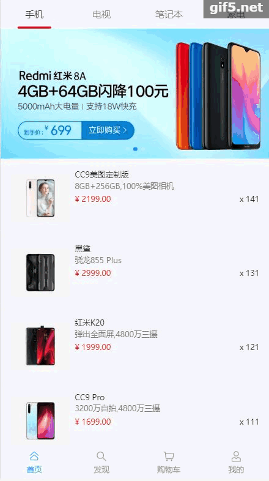

 # 前言
[](https://github.com/spring-projects/spring-boot)
[](https://github.com/vuejs/vue)
[](https://github.com/ElemeFE/element)
[](https://youzan.github.io/vant/#/zh-CN/intro)
[](https://github.com/enilu/linjiashop/blob/master/LICENSE)
 


- linjiashop是一个基于[Spring Boot](https://spring.io/projects/spring-boot/)和[Vue.js](https://cn.vuejs.org)的web系统，包含了基于[element](https://element.eleme.cn/#/zh-CN)搭建的但商户的商城系统。
- linjiashop具备后台管理类系统的通用的基础功能和商城业务功能
- linjiashop提供了手机端的商城系统
- linjiashop小程序版开发中
- linjiashop app版(基于Flutter)开发中
 

## 功能模块
linjiashop包含了后台管理功能和手机端商城业务功能
- 基础模块
    - 部门管理
    - 用户管理
    - 角色管理
    - 菜单管理
    - 权限分配
    - 参数管理
    - 数据字典管理
    - 定时任务管理
    - 操作日志
    - 登录日志
    - cms内容管理
    - 消息管理：配置消息模板，发送短信，邮件消息
    - 基于idea插件的代码生成
- 商城功能
    - 店铺管理
    - 类别管理
    - 商品管理    
    - 订单管理
    - 购物车列表
- 手机端
    -完整的商城购物功能        

## 技术选型
- 核心框架：Spring Boot
- 数据库层：Spring data jpa
- 数据库连接池：Druid
- 缓存：Ehcache
- 前端：后台管理基于[element](http://element-cn.eleme.io)，手机端界面基于[vant](https://youzan.github.io/vant/#/zh-CN/intro)


## 目录说明
- linjiashop-admin PC端后台管理的前端网页
- linjiashop-admin-api PC端后台管理的api服务
- linjiashop-mobile 手机商城的前端网页
- linjiashop-mobile-api 手机端商城的api服务
- linjiashop-core 基础模块，包括工具类，dao，service，bean等内容
- linjiashop-generator 代码生成模块,主要生成后台管理的前后端代码,配合IDEA 代码生成插件[webflash-generator](https://plugins.jetbrains.com/plugin/12648-webflash-generator)使用效果更好
## 运行效果图
- 手机端：

- 后台管理：

## 演示
- 手机版本：[http://linjiashop.microapp.store](http://linjiashop.microapp.store)
- 后台管理：[http://linjiashop-admin.microapp.store](http://linjiashop-admin.microapp.store) 请不要随意删除测试数据，谢谢

## 快速开始
- 克隆本项目
- 导入idea或者eclipse
- 确保开发工具下载并安装了lombok插件
- 创建数据库：linjiashop
     ```sql
    CREATE DATABASE IF NOT EXISTS linjiashop DEFAULT CHARSET utf8 COLLATE utf8_general_ci; 
    CREATE USER 'linjiashop'@'%' IDENTIFIED BY 'linjiashop191028';
    GRANT ALL privileges ON linjiashop.* TO 'linjiashop'@'%';
    flush privileges;
    ```     

- 启动后台管理
    - 启动后台管理api服务:linjiashop-admin-api
        - 修改linjiashop-admin-api中数据库连接配置
            ```properties
            ## 首次启动需要设置下列配置项设置为create，以便系统可以自动创建表并导入./import.sql测试数据文件
            ## 如果下面配置无法自动建表并导入测试数据文件；则可以手动初始化数据库，手动使用的初始化文件文件位于：doc/database.sql
            spring.jpa.hibernate.ddl-auto=create
            ```                    
        - 启动linjiashop-admin-api主类：cn.enilu.flash.api.AdminApiApplication，访问http://localhost:8082/swagger-ui.html ， 保证api服务启动成功
    - 启动后台管理的前端界面:linjiashop-admin
        - 运行 npm install --registry=https://registry.npm.taobao.org
        - 运行npm run dev
        - 启动成功后访问 http://localhost:9528 ,登录，用户名密码:admin/admin 
- 启动手机端商城
    - 启动手商城的api服务:linjiashop-mobile-api   
        - 修改linjiashop-mobile-api中数据库连接欸配置
        - 启动linjiashop-mobile-api主类：cn.enilu.flash.MobileApiApplication,访问http://localhost:8081/swagger-ui.html ， 保证api服务启动成功
    - 启动手机商城的前端:linjiashop-mobile
        - 运行 npm install --registry=https://registry.npm.taobao.org
        - 运行npm run dev
        - 启动成功后访问 http://localhost:8080/#/index
 
 
## 技术交流
- QQ群：254059156
- 微信：myenilu,添加请备注：邻家小铺
## 在线文档
- 该项目克隆并扩展自[web-flash](https://github.com/enilu/web-flash),所以开发的时候多看看web-flash的[在线文档](http://enilu.gitee.io/web-flash)
- 该项目手机端linjiashop-mobile使用有赞Vant组件库，开发过程可以参考Vant的[在线文档](https://youzan.github.io/vant/#/zh-CN/intro) 
- 该项目的业务功能参考[litemall](https://github.com/linlinjava/litemall)，感谢[linlinjava](https://github.com/linlinjava)
 
