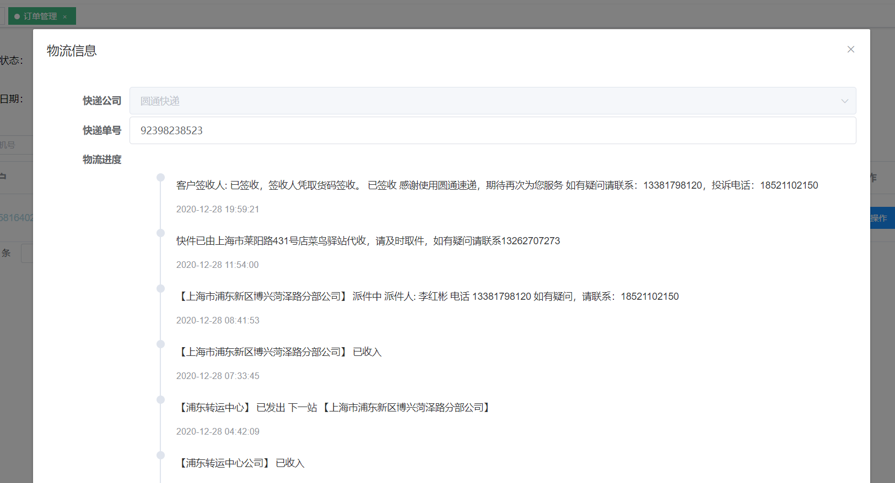
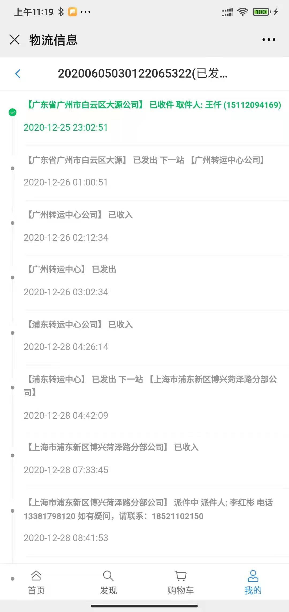

# 物流对接

## 设计
本系统针对物流对接需求设计如下
- 定义顶级物流相关接口：ExpressApi
- 针对每类物流服务接口商需要新建一个类并实现上述ExpressApi接口
- 系统参数中配置系统当前要使用的对接服务，比如邻家小铺系统默认对接的是快递鸟的物流查询服务，则系统参数配置如下：
    ```
        cfgkey   = api.express.info.query.provider
        cfgValue = kdniaoService
    ```

## 使用
- 系统目前仅对接了个查询实时订单功能(见：ExpressApi.java)
```java
    
    /** 
     * 查询快递实时信息
     * @param orderNo 快递单号
     * @param companyCode 快递公司编码
     * @return
     */
    ExpressInfo   realTimeQuery(String orderNo, String companyCode) ;
```
- 在后台管理和用户端可以查看已发货的的订单的快信息
    - 后台管理
        
    - 用户端
        