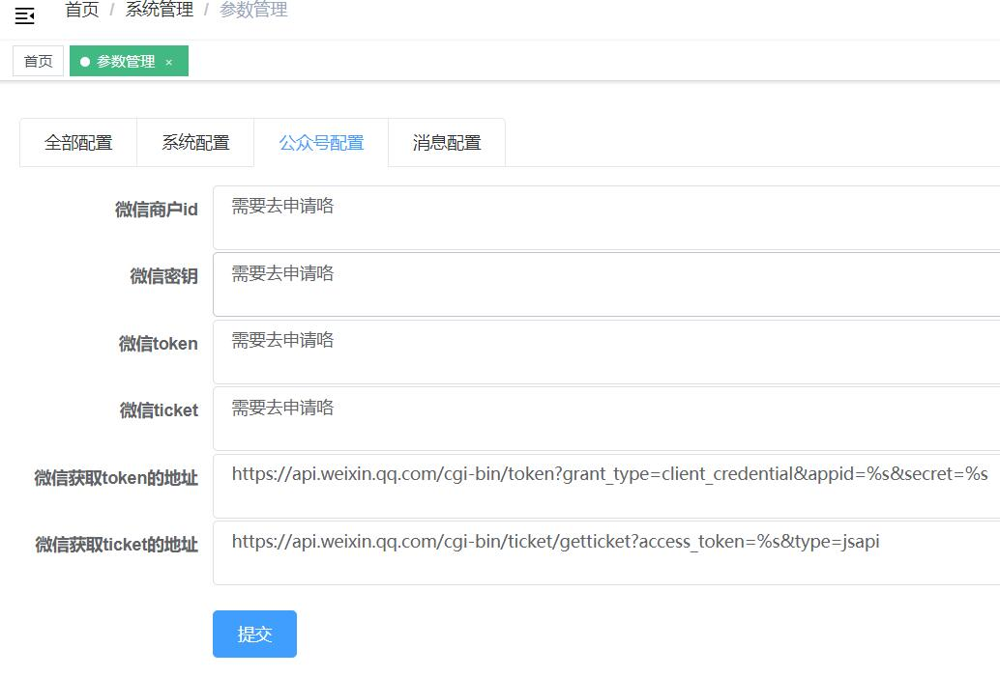

# 对接微信
本章节从获取微信token，获取微信信息等几方面来说明系统如何和微信做对接。

## 基础配置
目前系统针对微信对接在参数管理中提供了如下的参数配置，后期如果有需要可以自行添加
```
- 微信商户id:   	        weixin.app.id
- 微信密钥:     	        weixin.app.secret
- 微信获取token的地址:	    weixin.access.token.url
- 微信获取ticket的地址:   weixin.js.api.ticket.url
- 微信token:	            weixin.access.token
- 微信ticket:	        weixin.js.api.ticket
```

- 上面参数中前四个需要事先配置好，具体参数代表的意思不再赘述，不明白的请自行查阅微信官方文档或者google。其中前四项需要根据自己的实际情况配置，后两项参数的值由定时任务定时调用微信接口去获取。
- 本系统提供了一个定时任务：UpdateWeixinTokenJob 来定时获取微信token和ticket，获取成功后会存放到参数表中。
- 另外建议微信相关配置参数的key值都以"weixin"开头，这样可以复用后台管理中参数管理的分组功能；如下图所示，微信相关配置都在公众号配置组下：


### 定时任务获取微信token和ticket
- 微信token和ticket是针对微信相关操作的基础。大部分微信相关操作都需要用到这两个值。
- 系统默认提供了定时任务：UpdateWeixinTokenJob 来每隔一个小时获取一次上面两个值并存在参数配置表(t_sys_cfg)中

## 获取用户信息
linjiashop-mobile项目提供了用户登录后获取微信用户基本信息（微信昵称、头像、openid）的功能
src/view/user/user.js中当用户成功获取基本信息后，会紧接着获取微信相关信息。
部分代码示例：
```javascript
init() {
    userApi.getUserInfo().then(response => {
        const url = window.location.href
        if(url.indexOf('localhost')>-1 || url.indexOf('127.0.0.1')>-1) {
            console.log('开发环境不获取openid')
        }else{
            const userAgent = window.navigator.userAgent.toLowerCase()
            //使用微信访问本系统的时候获取微信用户基本信息，否则不获取
            if(userAgent.indexOf('micromessenger'>-1)) {
                this.processOpenid();
            }
        }
    }).catch((err) => {
        this.$router.replace({path:'login',query:{redirect:'user'}})
    })
}
```
- 后台具体获取逻辑可以从上述代码进行调试跟进，继而查看和调整。

## 微信支付
linjiashop-mobile集成了微信支付来支付订单金额。支持微信支付通过以下步骤实现。

### 参数配置
- 配置微信支付相关参数：在配置文件linjiashop-mobile-api/src/main/resource/application-dev(prod).properties：

    ```properties
    wx.app-id=服务商的APPID
    wx.app-secret=APPID对应的接口密码
    wx.mch-id=商户号
    wx.mch-key=API密钥
    # 支付结果通知地址
    wx.notify-url=http://linjiashop.microapp.store/prodp-api/pay/wx/notify
    #商户证书文件路径
    wx.key-path= /data/linjiashop...
    ```
### maven依赖
- 本系统使用了weixin-java-pay封装的微信的java sdk，因此需要在maven以来中加入改项目，另外小程序和h5用的同一个后台，因此同时也加入了小程序的java sdk：weixin-java-miniapp（小程序暂未对接）
    ```xml
     <dependency>
        <groupId>com.github.binarywang</groupId>
        <artifactId>weixin-java-pay</artifactId>
        <version>3.3.0</version>
    </dependency>
    <d3.ependency>
        <groupId>com.github.binarywang</groupId>
        <artifactId>weixin-java-miniapp</artifactId>
        <version>3.</version>
    </dependency>
    ```
- 后台的微信支付相关对接代码参阅：WeixinPayService
### 前端提交微信支付
前端支付相关代码：
- 提交支付：linjiashop-mobile/src/view/order/payment/index.vue 
- 支付结果界面：linjiashop-mobile/src/view/order/payment/callback/index.vue 
### 支付结果通知
- 前端发起微信支付提交之后，微信会通过配置的通知地址将支付结果主动送过来，本项目默认的的微信通知地址应配置为：http://域名/prod-api/pay/wx/notify；可根据实际情况自行调整

    ```java
        /**
         * 微信支付回调
         * @return
         */
        @RequestMapping(value = "wx/notify",method = RequestMethod.POST)
        public Object wxNotify(){
            String  msg = weixinPayService.resultNotify();
            return Rets.success(msg);
        }
    ```    
    
## 微信模板消息（未开发）


