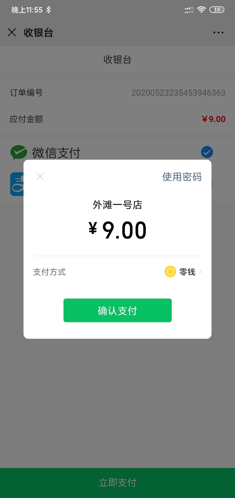
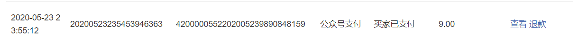

# 06- 对接微信支付
- 前面说过，上线一开始的时候就让朋友帮忙申请开通微信支付功能。
- 而系统本身已经具备微信支付功能，只需要将微信支付相关参数配置即可：

```properties
# 以下两个参数需要登录微信公众号后台获得
wx.app-id=微信公众号id
wx.app-secret=公众号密钥
# 以下相关参数需要登录微信支付商户后台获得
wx.mch-id=微信支付商户号
wx.mch-key=微信支付密钥
wx.notify-url=微信支付结果通知地址
# 商户证书文件路径
wx.key-path= 使用微信支付提供的证书生成程序生成证书文件，机器将文件：apiclient_cert.p12 放在系统指定路径上，这里配置绝对路径

```

测试支付成功
手机端截图：


微信支付商户后台资金流水截图：


